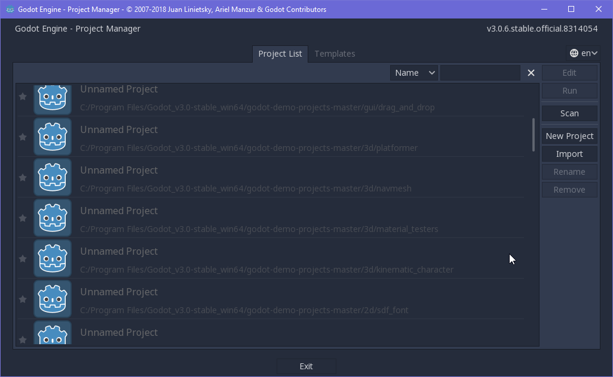
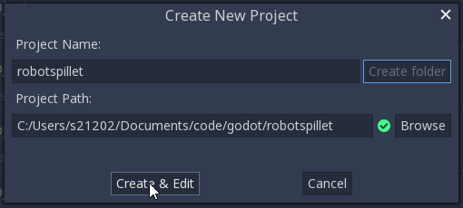
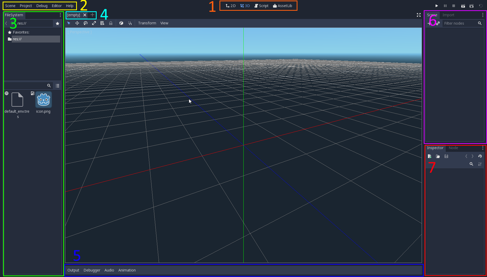

# Introduksjon

Denne innføringen har som mål å lære deg hvordan programmet Godot er satt
sammen, vise hvordan de mest grunnleggende operasjonene i programmet gjøres,
og demonstrere hvordan du kan lage et svært enkelt spillkonsept.

Merk at videre oppgaver vil basere seg på de oppgavene du løser her. Ta vare
på kodefilene og prosjektfilene du lager i løpet av arbeidet med disse
oppgavene.

# Oppgave 1: Start Godot {.activity}

- [ ] Finn Godot-programmet på datamaskinen din. Se på introduksjonssiden
  for å finne ut hvordan du får lastet det ned og lagt det i en mappe du 
  velger selv.

# Oppgave 2: Lag et nytt prosjekt {.activity}

Det første vinduet i Godot er prosjektvelgeren. 

- [ ] Klikk på **New Project** for å lage et nytt prosjekt.

- [ ] Velg en passende mappe i hjemmeområdet ditt og skriv inn navnet på spillet,
  for eksempel *robotspillet* siden vi etter hvert skal lage noen roboter som kan
  rusle rundt. Klikk på **Create Folder** for å lage en egen mappe for prosjektet
  ditt, og så **Create & Edit** for å sette i gang med å lage spillet ditt.

# Oppgave 3: Hovedvinduet {.activity}

Det første vinduet du ser når du åpner et prosjekt, er hovedvinduet i Godot.
Under følger en gjennomgang av de ulike elementene du kommer til å bruke
i dette kurset.

1. **1: Vindusvelgeren:** Her velger du hvilket hovedvindu du skal jobbe med.
  **3D**- og **2D**-vinduene viser deg hvordan *scenene* i spillet ditt ser
  ut, og **Script**-vinduet lar deg skrive kode. **AssetLib** er en nett-
  database over programtillegg og -utvidelser andre har laget som du kan
  laste ned og bruke til dine egne spill og prosjekter.
2. **2: Menyen:** Her kan du endre innstillinger og finne verktøymenyer for
  prosjektet ditt.
3. **3: Filutforskeren:** Et spill består av mange filer. Her finner du dem.
4. **4: Scenefaner:** En rekke med faner som lar deg veksle mellom scenene du
  har åpne.
5. **5: Verktøy:** Et vindu hvor du finner ulike verktøy, hovedsaklig utdata-,
  feilsøkings- og animasjonsvinduene.
6. **6: Nodelista:** Oversikt over hvilke *noder* scenene dine består av.
  Å lære seg scene- og nodesystemet i Godot er hovedpoenget med denne innføringen.
7. **7: Inspeksjonsvinduet:** Oversikt over hvilke innstillinger, attributter
  og verdier nodene dine er satt opp med. Ved siden av kodevinduet, er
  inspeksjonsvinduet og scenevinduet (det store, tomme vinduet midt på skjermen)
  de mest brukte i Godot.

  Resten av innføringen består i å gå gjennom noen av de mest brukte funksjonene
  i programmet.

- [ ] Klikk på **2D**-knappen i vindusvelgeren for å åpne sceneredigeringsvinduet
  for 2D-scener.