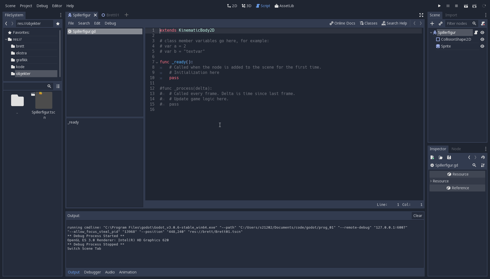
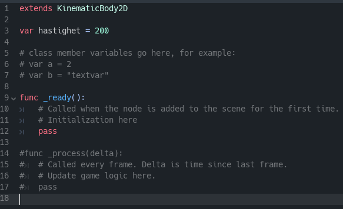
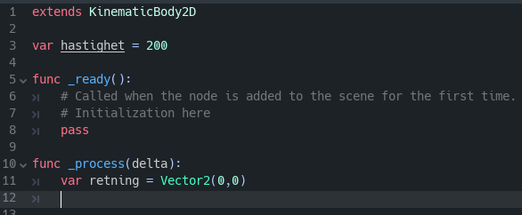
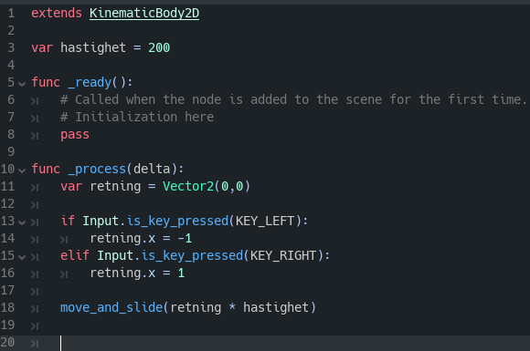
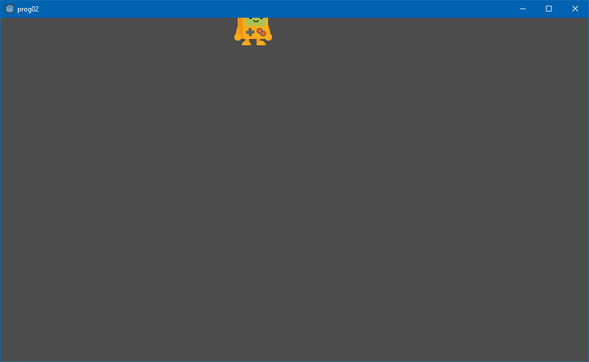
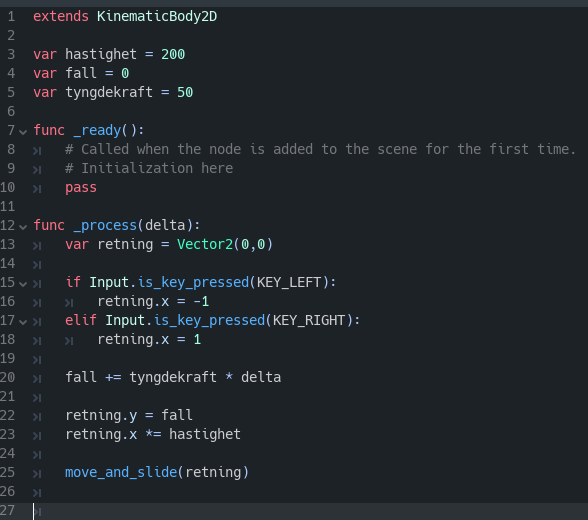

# Introduksjon

Dette oppgavesettet har som mål å vise deg hvordan du kan lage ditt eget
2D-plattformspill i Godot.

Å lage et spill er et veldig komplisert prosjekt, så for å forenkle litt vil
dette oppgavesettet bruke grafikk og effekter som stort sett er laget på
forhånd. Grafikken er hentet fra nettsiden https://kenney.nl/ som tilbyr
mange gratis grafikkfiler til fri benyttelse.

Fokus i dette oppgavesettet ligger på å øve på å skrive kode i Godot.

Det forutsettes at du allerede har gjort deg kjent med de grunnleggende
funksjonene i Godot, ved å gå gjennom innføringsoppgavene.


# Mål

Målet er å ende opp med et enkelt 2D-plattformspill som har disse elementene:
- En spillerfigur som kan gå til høyre og venstre, hoppe og skyte
- Et brett bestående av ulike plattformer og vegger som spilleren kan gå
  gjennom
- Fiender som kan skade spilleren
- En bossfigur som må bekjempes før spilleren kan fullføre brettet
- Enkle grafiske effekter


# Oppgave 1: Legg til grafikk {.activity}

Vi trenger noen grafikkfiler før vi kan sette i gang. Last ned disse filene
til datamaskinen din:

- [Spillerfigur-grafikk](./filer/platformerPack_character.png)
- [Brett-grafikk](./filer/platformPack_tilesheet.png)
- [Brikkesett](./filer/Brikkesett.tres)

- [ ] Start Godot og lag et nytt prosjekt. Kall det hva du vil.
- [ ] Høyreklikk i filutforskeren og velg "Open in File Explorer".
- [ ] Lag ei ny mappe, kall den "grafikk", og kopier filene du lastet ned
  over i denne nye mappa.

Husk at du må organisere filene dine så det er lett å finne fram i prosjektet.
Vi skal lage flere mapper etter hvert, og få tak i flere filer til spillet vårt.


# Oppgave 2: Lag en spillerfigur {.activity}

- [ ] Klikk på **2D**-fanen og klikk plusstegnet i nodelista for å legge til en
  ny node. Søk etter *KinematicBody2D*. Dette er en type node laget for å bygge
  spillfigurer som styres av kode, men fortsatt reagerer på omgivelsene i
  spillet.


Legg merke til varseltrekanten ved siden av den nye noden. Du kan klikke på den
for å se hva problemet er. Problemet er at selv om vi har laget en kodefigur, så
har vi ikke fortalt Godot hvordan den ser ut. Det skal vi fikse nå.

- [ ] Klikk på plusstegnet i nodelista og legg til en node av typen
  *CollisionShape2D*.

Denne noden har *også* en varseltrekant. Makan! Dette er fordi at selv om vi
har lagt til en *shape*, altså en form, har vi ikke sagt *hvilken* form det er
snakk om.

- [ ] Velg den nye noden og finn verdien *Shape* i inspeksjonsvinduet. Klikk
  på pila i feltet ved siden av, og velg *New Rectangle Shape*.

Nå har vi laget en figur, men den vises ikke på skjermen. Det skal vi fikse nå.

- [ ] Legg til en ny node av typen *Sprite*.
- [ ] Finn Sprite-noden i treet og velg den. I inspeksjonsvinduet finner du
  verdien *Texture*. Bla deg fram til grafikkmappa i filutforskeren, finn fila
  som heter *platformerPack_character.png* og dra den over i *Texture*-feltet
  du akkurat så på.


Ser man det, ja. Dette er figuren du skal lage i dette spillet. Men: Det er alt
for mange figurer her. Faktisk så er det alle bildene i *animasjonen* som til
sammen blir bevegelsene figuren kan gjøre. En vanlig spillteknikk er å lagre
animasjoner sammen i en fil som dette, og så "klippe ut" det bildet du trenger
for å vise det på skjermen. Det skal vi gjøre nå.

- [ ] Velg *Sprite*-noden din og se i inspeksjonsvinduet. Finn verdien
  *Animation* og klikk på den. 
- [ ] Legg merke til at den har tre felt: *Vframes*, *Hframes* og *Frame*.
<<<<<<< HEAD
  Hframes er hvor mange bilder animasjonen består av horisontalt (bortover),
  Vframes er hvor mange bilderader animasjonen består av vertikalt (nedover),
  og Frame er hvilket bilde som vises for øyeblikket. Tenk deg at bildene
  nummereres først bortover og så nedover.
- [ ] Animasjonen vår har fire bilder bortover og to rader, så sett Hframes til
  4 og Vframes til 2.
- [ ] Godot regner automatisk ut hvor store bildene skal være for deg. Prøv å
  endre Frame og se hvordan figuren endrer seg.

Vi kommer bare til å bruke de fire første bildene, siden figuren vår bare skal
kunne stå stille, gå, og hoppe. Godot har også en finfin mulighet for å animere
ting automatisk, men bare for å være litt vriene skal vi animere figuren i kode.
Men først skal vi få den til å flytte seg rundt på skjermen.


# Oppgave 3: Få figuren til å flytte seg {.activity}

- [ ] Høyreklikk på **KinematicBody2D** i nodelista og legg til et script
  (Attach Script).
- [ ] Hvor skal vi lagre scriptet? Lag en mappe (Create Folder) og kall den *kode*.
- [ ] Pass på at du lagrer kodefila di der. Kall fila **spillerfigur.gd**.

Nå skal du få opp en standard kodefil som ser omtrent sånn ut:



Vi trenger å skrive kode som skal gjøre følgende:

1. Bestemme hvor fort figuren skal bevege seg.
2. Finne ut om spilleren trykker på en bevegelsestast.
3. Angi hvilken retning figuren skal bevege seg i.
4. Flytte figuren på skjermen.
5. Stoppe figuren hvis den støter på en hindring.
6. La spilleren hoppe over hindre.

Dette virker kanskje litt selvsagt, men det er ofte nyttig å dele opp det du skal
gjøre i mindre oppgaver slik som dette. Da kan du jobbe med en ting av gangen, og
enkelt se om du har nådd målet ditt.

Vi setter i gang. Husk at kode som regel utføres ovenfra og ned, en og en linje av
gangen. Vi starter med å bestemme hastigheten på spilleren:

- [ ] Sett inn denne kodelinja to linjer under ```extends KinematicBody2D```:
  ```var hastighet = 200```



Linjene med `#`-tegn foran er *kommentarer*. De er der for å forklare koden, og
har ingenting å si for programmet som kjøres. De tre øverste linjene med
kommentarer kan du trygt slette nå.

Uansett, første deloppgave er utført; vi har satt hastigheten til 200. Hva vil
det si? Akkurat nå: Ingen verdens ting. Spillet vet ikke hva vi har tenkt å bruke
variabelen "hastighet" til, eller hva det vil si at den er 200. Vi trenger mer
kode for å få datamaskinen til å forstå hva vi prøver å gjøre.

Vi fortsetter med å sjekke om spilleren har trykket inn en piltast, og dermed
vil at figuren skal flytte på seg. Denne sjekken må spillet foreta hele tiden,
siden mye kan skje på ett sekund. Godot er laget slik at all kode som legges i
funksjonen kalt *_process* kjøres konstant. Men: Hvis du skriver noe i den
funksjonen nå, vil det ikke skje noen ting. Ser du hvorfor? Linja som viser
hvor _process begynner, er kommentert ut. 

- [ ] Fjern #-tegnet foran linja ```func _process(delta):```.
- [ ] Slett alle de kommenterte linjene under.
- [ ] Skriv inn denne linja under ```func _process(delta):```:
  ```var retning = Vector2(0,0)``` 



Denne linja er svært viktig, og den bruker en veldig nyttig ting i Godot.
Informasjon i et dataprogram kan lagres på mange ulike måter, og det er viktig å
bruke riktig lagringsmåte i hvert tilfelle. Det vi har gjort nå, er å angi at
*retning* skal være navnet på en variabel med *datatype* `Vector2`. Godot har
innebygde datatyper for *vektorer*, og dette er ekstremt nyttig når man lager
spill.

En vektor er - veldig enkelt og dårlig forklart - en verdi som kan vise til både
et *punkt* i et koordinatsystem, en *retning* og en *avstand*. Spillet vi skal
lage nå bruker bare to dimensjoner (bredde og høyde), og derfor bruker vi 
*Vector2*. Denne datatypen har en vektor for bredde og en for høyde og kan dermed
brukes til å angi både *plassering*, *retning* og *avstand* for figuren vår i 2D-
verdenen spillet foregår i. Hadde vi skullet lage et 3D-spill, måtte vi brukt
*Vector3*.

Det vi skal gjøre, er å lese tastetrykk fra spilleren og endre verdiene på
*retning* for å vise hvilken vei figuren skal gå. Den første verdien er x, altså
horisontalt (bortover), og den andre er y, altså vertikalt (nedover).

- [ ] Sett inn denne koden etter den forrige linja: 
=======
  


# Oppgave 3: Spillerkode {.activity}


```python
extends KinematicBody2D

var animasjon = 0
var animasjonshastighet = 200
var animasjonstid = 0
var animasjonsretning = 1
var bytt_bilde = false

func _process(delta):
	var flytt = Vector2(0,0)

  if Input.is_key_pressed(KEY_LEFT):
    flytt.x = -1 * hastighet
    animasjonsretning = -1
  elif Input.is_key_pressed(KEY_RIGHT):
    flytt.x = 1 * hastighet
    animasjonsretning = 1

  var flyttresultat = move_and_slide(flytt, Vector2(0,-1))

  var tid = OS.get_ticks_msec()
		if tid >= animasjonstid + animasjonshastighet:
			bytt_bilde = not bytt_bilde
			animasjonstid = tid
    
  animasjon = 2
  if bytt_bilde:
    animasjon = 3
  
  $Sprite.frame = animasjon
  $Sprite.scale.x = animasjonsretning
```


# Oppgave 4: Din første scene {.activity}

Husker du at nodelista ligger til høyre? Vi kan bruke nodelista til å legge til
nye noder i den tomme scenen din. Noder har en *type* og et *navn*. Godot har
veldig mange ferdiglagde noder innebygd, noe som er til stor hjelp når vi skal
lage våre egne spill. Det er faktisk så mange at det kan være overveldende å
legge til riktig node. Derfor må du tenke gjennom hva du skal lage før du
setter i gang.

- Vi skal lage en liten robot vi kan bruke kode til å styre rundt på skjermen.
- For at roboten skal synes, må den kunne vise et bilde som beveger seg rundt.
- Vi trenger også en kodefil som kan styre roboten.

Vi begynner med å legge til et bilde. 

- [ ] I nodelista trykker du på plusstegnet, for å legge til en ny node. 

Nodevelgeren lar deg enkelt bla gjennom nodelista
eller søke opp noder hvis du vet hva de heter. Før vi velger node, legg merke
til sorteringen og fargekodingen:

- Lilla noder ligger under *Node2D*-kategorien og er ment å brukes i 2D-spill.
- Rosa noder ligger under *Spatial*-kategorien og er ment å brukes i 3D-spill.

2D-grafikk kalles ofte for *sprites*. Godot har en ferdig Sprite-node vi skal
bruke. Du kan enten bla deg fram og utforske litt, eller bare søke opp "sprite".


- [ ] Trykk på **Create**. Legg merke til at en ny node ved navn "Sprite" 
  ligger i nodelista.


Du vil også se noen rosa prikker i hovedvinduet. Disse viser en ramme rundt
det nye bildet du la til. Siden du ikke har lagt inn et bilde ennå, er den
veldig liten og inneholder ingenting. La oss legge til et bilde. Velg
*Sprite*-noden i nodelista, og legg merke til feltet kalt *Texture* i
inspeksjonsvinduet under nodelista.

Et Godot-prosjekt har nesten ingenting inkludert når du først lager det,
men et enkelt ikon med Godot-roboten på følger med. Det heter *icon.png*.
PNG er navnet på et vanlig bildeformat og det vi skal bruke i Godot.

- [ ] Klikk og dra bildet over i boksen det står *<null>* i ved siden av 
  *Texture* i inspeksjonsvinduet.


Så enkelt var det. Nå har vi et nyyydelig bilde vi kan flytte rundt på
skjermen. På tide å skrive kode. Men først gir vi noden vårt et nytt navn,
ettersom det fort blir forvirrende hvis vi skal holde styr på masse noder
med navn som *Sprite2*, *Sprite3* osv. 

- [ ] Klikk på *Sprite* i nodelista to ganger, og skriv inn et nytt navn,
  for eksempel *Robot*. 
- [ ] Nå klikker du med høyre mustast på Robot og velger
**Attach Script**.


# Oppgave 5: Ditt første script {.activity}


- *Language:* GDScript er standard-scriptspråket i Godot og det vi skal
  bruke.
- *Inherits:* Et valg som angir hva slags node scriptet kan brukes på.
  Denne er automatisk satt til *Sprite* siden vi la til script på en
  sprite-node. Dette valget er viktig fordi det bestemmer hvilke
  nodefunksjoner vi kan bruke i scriptene våre. Ikke endre noe her.
- *Class Name:* Et valg som ikke gjør noe akkurat nå, og som ikke skal
  brukes i dette kurset...
- *Template:* Bestemmer hvilken kodemal du vil bruke på den nye script-
  fila di. "Default" passer bra.
- *Built-in Script:* Lar deg bygge inn script som bare skal brukes på
  ett objekt. Når denne slås av, lagres scriptet i en egen fil og kan
  brukes på flere objekter. La den være avslått.
- *Path:* Hvilken mappe scriptet skal ligge i. Filbehandling er alltid
  viktig, også i Godot. Her skal du trykke på mappeikonet. Velg
  **Create Folder** øverst til høyre, kall den nye mappa *kode* og
  trykk **OK**. Trykk **Save**.

Godot sjekker at alt er i orden og viser deg resultatet i den nederste
boksen. Der skal det stå "Script valid" og "Create new script file".

- [ ] Trykk **Create** for å lage scriptet ditt.


Nå ser du scriptvinduet. Legg merke til alt som har skjedd: Du har
en ny mappe i filutforskeren til venstre kalt "kode", og i scriptlista
øverst til venstre i scriptvinduet har du nå en fil kalt "Robot.gd" (.GD
er filtypen som brukes til å lagre scripts i Godot).
Du har også noen nye menyer og en ny liste nederst til venstre i
scriptvinduet. Til alt overmål er det også flere kodelinjer i vinduet.
Lista nederst til venstre er en oversikt over *funksjonene* i scriptet
ditt, noe du sikkert kjenner til hvis du har programmert før. Vi går
gjennom koden.

>>>>>>> 2fc513b409c8a57008d28114cb3b64c456961fe5
```python
if Input.is_key_pressed(KEY_LEFT):
  retning.x = -1
elif Input.is_key_pressed(KEY_RIGHT):
  retning.x = 1
```

Her bruker vi to *if-setninger* til å se om enten venstre eller høyre piltast
er trykket inn. ```Input``` er navnet på systemet Godot har for å lese av f.eks.
tastetrykk, musebevegelser, trykk på berøringsskjerm, spillkontrollerknapper osv.
Dette systemet har en funksjon kalt ```is_key_pressed()``` som sjekker om tasten
du angir i parentesene er trykket inn og sender tilbake enten sant eller usant,
dvs. ```true``` eller ```false```. ```if```-setningen sjekker om det som kommer
etter *if*-en er sant eller usant; hvis det er sant, kjøres koden på linjene
under. Hvis ikke hopper den videre til neste linje i blokka. ```elif``` er en
forkortelse for *else if*, og kjører samme test som *if*, men bare hvis forrige
*if* var usann. Henger du med? Dette er kanskje litt komplisert, men det gir
mening etter hvert. Jeg lover!

Uansett, hvorfor kjører vi bare en av linjene? Hvorfor kan vi ikke bare kjøre
begge to?

Svaret er at så klart *kan* vi det. Men: Hvis spilleren har trykket mot venstre,
kan vi gå ut fra at hen ikke samtidig vil gå mot høyre. Dermed kan vi enkelt
bestemme oss for at den neste linja ikke vil behøves i dette tilfellet.
Akkurat her utgjør det liten praktisk forskjell (test deg selv: Hva ville
forskjellen vært hvis vi brukte to *if* istedenfor en *if* og en *elif*?), men
i mer kompliserte programmer kan det være nyttig å avgjøre hvilken del av koden
som kjører i hvilke tilfeller. Og nå vet du hvordan du kan gjøre det tydelig
hva som skjer når.

Nok prat (beklager!), la oss se hva vi faktisk har gjort. Vi har bestemt
hastighet, og vi har funnet retning. Vi mangler faktisk bare å få spillet til å
forstå hva det skal bety.

I Godot har ```KinematicBody2D``` flere innebygde funksjoner for å flytte på
en spillfigur. En av disse heter ```move_and_slide()```. Den flytter figuren,
og stopper den ved hindringer den kolliderer med. Denne funksjonen krever at vi
sender den en ```Vector2``` for å angi retning og hastighet. Noe av det geniale
med vektorer, er at de lett kan multipliseres med desimaltall. Dermed kan vi
multiplisere retningsvektoren med hastigheten og sende det til funksjonen:

- [ ] Skriv inn denne koden etter if-blokka: 
  ```move_and_slide(retning * hastighet)```



Nå kan du faktisk teste spillet ditt. Kall *KinematicBody2D* i nodelista for
*Spiller* hvis du ikke alt har gjort det, og trykk på *F6*-tasten. Du må
lagre scenen før du får testet. Lag en ny mappe kalt *Objekter* og lagre
scenen der (den kalles automatisk *Spiller* hvis du ga noden nytt navn).



- [ ] Trykk på venstre og høyre piltast.
- [ ] Beveger figuren seg?
- [ ] Hvis ja: Hurra!
- [ ] Hvis nei: Gå til feilsøkingsvinduet i Godot (nederst, velg
  *Debugger*-fanen og så *Errors*-fanen). Kanskje du har skrevet noe feil,
  eller glemt å bruke riktig innrykk? Sammenlign med bildet av koden over.
  Den viser hvordan ting skal se ut.

Hvor mange av målene for figuren vår har vi nådd? Vi har angitt hastighet,
vi har fått en retning, vi har fått den til å flytte seg, og vi har faktisk
også fått den til å stoppe når den møter en hindring (se bort fra at det
ikke eksisterer noen hindringer å møte ennå). Men den kan ikke hoppe, eller
en gang falle! Planen vår har med andre ord minst en mangel; vi må *sørge
for at figuren følger tyngdekraftens lover*. Eller i det minste få det til
å se sånn ut.

(En annen mangel: Vi ser ikke hele figuren! Dette problemet sparer vi til
seinere.)


# Oppgave 4: Tyngdekraft! {.activity}

Å skape tyngdekraft er faktisk ikke så vrient. Vi bare lager en ny variabel
kalt tyngdekraft øverst, under *hastighet*:
```var tyngdekraft = 50```

(Hvorfor er hastigheten 200 og tyngdekraften 50? Kort svar: Fordi jeg prøvde
meg fram og syntes de passet bra. Hvor fort bevegelsene til objektene på skjermen
oppleves avhenger av mange ting, og det viktigste er at du synes de *føles*
riktig. Tallene har ingen betydning i seg selv, det er koden som gir dem mening.)

For å løse problemet med tyngdekraften, må vi endre litt på koden vår. Vi har
gjort noen valg tidligere som viser seg å være litt for begrensende. Vi må
regne ut gå-hastigheten og fall-hastigheten hver for seg. Lag en ny variabel
under *tyngdekraft*, og kall den *fall*:
```var fall = 0```

Dette er så vi kan holde styr på hvor fort figuren faller mellom hver gang
vi finner retningen i koden vår. Fallhastigheten skal styres automatisk av
spillet, så da må vi holde styr på den for seg selv.

Etter *if*-blokka og før *move_and_slide* regner vi ut dette:
```python
fall += tyngdekraft * delta
	
retning.y = fall
retning.x *= hastighet
```
Her øker vi fallhastigheten konstant for å etterligne tyngdekraften, før vi
setter y-retningen til fallhastigheten og regner ut gå-hastigheten. Lurer du
på hva ```+=``` og ```*=``` betyr? Og hva er egentlig ```delta```?

```+=``` er en snarvei som betyr "legg det som kommer til høyre for =-tegnet
til det som står til venstre". ```*=``` betyr "multipliser det som kommer til
høyre for =-tegnet med det som står til venstre". Og ```delta```? Det er et
tall som regnes ut automatisk av Godot (og sendes til *_process* hver gang
den kjøres), og forteller spillet hvor lang tid det tok å kjøre forrige
oppdatering av spillet. Dette er så spillet ditt kjører i samme hastighet
på alle maskiner, siden datamaskiner kan ha svært ulik hastighet. Ved å
multiplisere med ```delta``` kan du være trygg på at spillet går like fort
på en rask stasjonær maskin som på en gammel bærbar.

Siden vi regner ut hastighetene separat, må vi endre på vektoren vi sender
til *move_and_slide*:
```move_and_slide(retning)```



- [ ] Trykk på *F6*-tasten igjen og test spillet ditt.
- [ ] Faller figuren stadig raskere nedover skjermen?

# Oppgave 5: b {.activity}

y