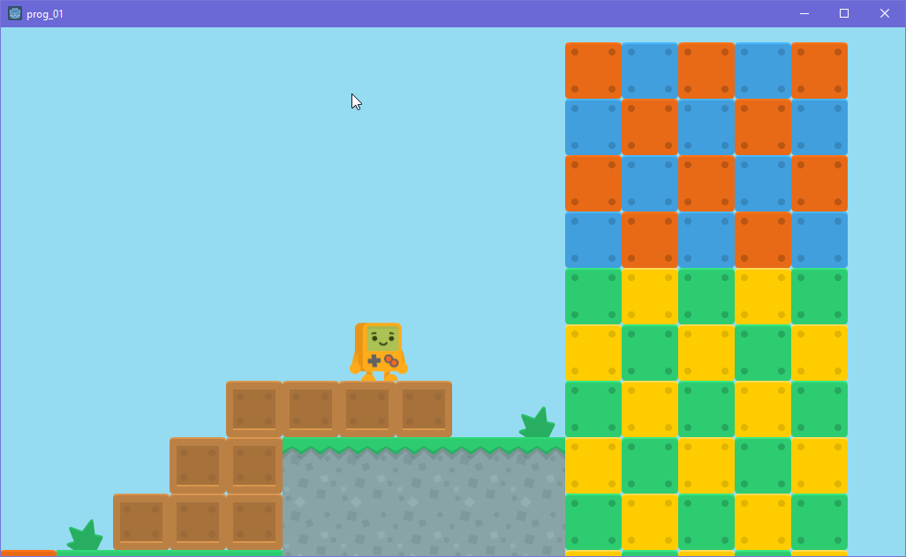

# Introduksjon

Dette oppgavesettet har som mål å vise deg hvordan du kan lage ditt eget
2D-plattformspill i Godot.

Å lage et spill er et veldig komplisert prosjekt, så for å forenkle litt vil
dette oppgavesettet bruke grafikk og effekter som stort sett er laget på
forhånd. Grafikken er hentet fra nettsiden https://kenney.nl/ som tilbyr
mange gratis grafikkfiler til fri benyttelse.

Fokus i dette oppgavesettet ligger på å øve på å skrive kode i Godot.

Det forutsettes at du allerede har gjort deg kjent med de grunnleggende
funksjonene i Godot, ved å gå gjennom innføringsoppgavene.



# Mål

Målet er å ende opp med et enkelt 2D-plattformspill som har disse elementene:
- En spillerfigur som kan gå til høyre og venstre, hoppe og skyte
- Et brett bestående av ulike plattformer og vegger som spilleren kan gå
  gjennom
- Fiender som kan skade spilleren
- En bossfigur som må bekjempes før spilleren kan fullføre brettet
- Enkle grafiske effekter


# Oppgave 1: Legg til grafikk {.activity}

Vi trenger noen grafikkfiler før vi kan sette i gang. Last ned disse filene
til datamaskinen din:

- [Spillerfigur-grafikk](./filer/platformerPack_character.png)
- [Brett-grafikk](./filer/platformPack_tilesheet.png)
- [Brikkesett](./filer/Brikkesett.tres)

- [ ] Start Godot og lag et nytt prosjekt. Kall det hva du vil.
- [ ] Høyreklikk i filutforskeren og velg "Open in File Explorer".
- [ ] Lag ei ny mappe, kall den "grafikk", og kopier filene du lastet ned
  over i denne nye mappa.

Husk at du må organisere filene dine så det er lett å finne fram i prosjektet.
Vi skal lage flere mapper etter hvert, og få tak i flere filer til spillet vårt.


# Oppgave 2: Lag en spillerfigur {.activity}

- [ ] Klikk på **2D**-fanen og klikk plusstegnet i nodelista for å legge til en
  ny node. Søk etter *KinematicBody2D*. Dette er en type node laget for å bygge
  spillfigurer som styres av kode, men fortsatt reagerer på omgivelsene i
  spillet.


Legg merke til varseltrekanten ved siden av den nye noden. Du kan klikke på den
for å se hva problemet er. Problemet er at selv om vi har laget en kodefigur, så
har vi ikke fortalt Godot hvordan den ser ut. Det skal vi fikse nå.

- [ ] Klikk på plusstegnet i nodelista og legg til en node av typen
  *CollisionShape2D*.

Denne noden har *også* en varseltrekant. Makan! Dette er fordi at selv om vi
har lagt til en *shape*, altså en form, har vi ikke sagt *hvilken* form det er
snakk om.

- [ ] Velg den nye noden og finn verdien *Shape* i inspeksjonsvinduet. Klikk
  på pila i feltet ved siden av, og velg *New Rectangle Shape*.

Nå har vi laget en figur, men den vises ikke på skjermen. Det skal vi fikse nå.

- [ ] Legg til en ny node av typen *Sprite*.
- [ ] Finn Sprite-noden i treet og velg den. I inspeksjonsvinduet finner du
  verdien *Texture*. Bla deg fram til grafikkmappa i filutforskeren, finn fila
  som heter *platformerPack_character.png* og dra den over i *Texture*-feltet
  du akkurat så på.


Ser man det, ja. Dette er figuren du skal lage i dette spillet. Men: Det er alt
for mange figurer her. Faktisk så er det alle bildene i *animasjonen* som til
sammen blir bevegelsene figuren kan gjøre. En vanlig spillteknikk er å lagre
animasjoner sammen i en fil som dette, og så "klippe ut" det bildet du trenger
for å vise det på skjermen. Det skal vi gjøre nå.

- [ ] Velg *Sprite*-noden din og se i inspeksjonsvinduet. Finn verdien
  *Animation* og klikk på den. 
- [ ] Legg merke til at den har tre felt: *Vframes*, *Hframes* og *Frame*.
  


# Oppgave 3: Hovedvinduet {.activity}

Det første vinduet du ser når du åpner et prosjekt, er hovedvinduet i Godot.
Under følger en gjennomgang av de ulike elementene du kommer til å bruke
i dette kurset.


1. **1: Vindusvelgeren:** Her velger du hvilket hovedvindu du skal jobbe med.
  **3D**- og **2D**-vinduene viser deg hvordan *scenene* i spillet ditt ser
  ut, og **Script**-vinduet lar deg skrive kode. **AssetLib** er en nett-
  database over programtillegg og -utvidelser andre har laget som du kan
  laste ned og bruke til dine egne spill og prosjekter.
2. **2: Menyen:** Her kan du endre innstillinger og finne verktøymenyer for
  prosjektet ditt.
3. **3: Filutforskeren:** Et spill består av mange filer. Her finner du dem.
4. **4: Scenefaner:** En rekke med faner som lar deg veksle mellom scenene du
  har åpne.
5. **5: Verktøy:** Et vindu hvor du finner ulike verktøy, hovedsaklig utdata-,
  feilsøkings- og animasjonsvinduene.
6. **6: Nodelista:** Oversikt over hvilke *noder* scenene dine består av.
  Å lære seg scene- og nodesystemet i Godot er hovedpoenget med denne innføringen.
7. **7: Inspeksjonsvinduet:** Oversikt over hvilke innstillinger, attributter
  og verdier nodene dine er satt opp med. Ved siden av kodevinduet, er
  inspeksjonsvinduet og scenevinduet (det store, tomme vinduet midt på skjermen)
  de mest brukte i Godot.

  Resten av innføringen består i å gå gjennom noen av de mest brukte funksjonene
  i programmet.

- [ ] Klikk på **2D**-knappen i vindusvelgeren for å åpne sceneredigeringsvinduet
  for 2D-scener.


Forskjellen på 2D- og 3D-vinduet er... en dimensjon. **2D** betyr at spillet
vises i *to dimensjoner*, altså bredde og høyde. **3D** betyr at spillet vises
i *tre dimensjoner*, altså bredde, høyde og dybde. Godot kan brukes til begge
deler, men for enkelhetens skyld holder vi oss til to dimensjoner innledningsvis.

To begreper det er veldig viktig å forstå i Godot er *scener* og *noder*.
En *scene* er bygd opp av noder, og utgjør kort fortalt alle klossene spillet
ditt er bygd opp av. I spillet ditt kan du ha en scene for spillerobjektet ditt,
en scene for en fiende, og en scene for bakgrunnsgrafikk, for eksempel. Men alle
disse scenene må også tilhøre en scene for å vises på skjermen; alle brettene i
spillet ditt er også scener, eventuelle mellomsekvenser og menyer kan også være
egne scener. Men: For at scenene skal faktisk gjøre noe i spillet ditt, må de
legges inn som *noder* i et *scenetre*. Hvert spill i Godot har ett scenetre,
og alle scenene som brukes må legges inn der som noder. Altså kan vi si at 
scener er *oppskriften* for hvordan objektene i spillet ditt skal oppføre seg,
og det er først når de legges inn som *noder* at de faktisk gjør noe i spillet.

Forvirrende? Vi prøver oss på et eksempel.


# Oppgave 4: Din første scene {.activity}

Husker du at nodelista ligger til høyre? Vi kan bruke nodelista til å legge til
nye noder i den tomme scenen din. Noder har en *type* og et *navn*. Godot har
veldig mange ferdiglagde noder innebygd, noe som er til stor hjelp når vi skal
lage våre egne spill. Det er faktisk så mange at det kan være overveldende å
legge til riktig node. Derfor må du tenke gjennom hva du skal lage før du
setter i gang.

- Vi skal lage en liten robot vi kan bruke kode til å styre rundt på skjermen.
- For at roboten skal synes, må den kunne vise et bilde som beveger seg rundt.
- Vi trenger også en kodefil som kan styre roboten.

Vi begynner med å legge til et bilde. 

- [ ] I nodelista trykker du på plusstegnet, for å legge til en ny node. 

Nodevelgeren lar deg enkelt bla gjennom nodelista
eller søke opp noder hvis du vet hva de heter. Før vi velger node, legg merke
til sorteringen og fargekodingen:

- Lilla noder ligger under *Node2D*-kategorien og er ment å brukes i 2D-spill.
- Rosa noder ligger under *Spatial*-kategorien og er ment å brukes i 3D-spill.

2D-grafikk kalles ofte for *sprites*. Godot har en ferdig Sprite-node vi skal
bruke. Du kan enten bla deg fram og utforske litt, eller bare søke opp "sprite".


- [ ] Trykk på **Create**. Legg merke til at en ny node ved navn "Sprite" 
  ligger i nodelista.


Du vil også se noen rosa prikker i hovedvinduet. Disse viser en ramme rundt
det nye bildet du la til. Siden du ikke har lagt inn et bilde ennå, er den
veldig liten og inneholder ingenting. La oss legge til et bilde. Velg
*Sprite*-noden i nodelista, og legg merke til feltet kalt *Texture* i
inspeksjonsvinduet under nodelista.

Et Godot-prosjekt har nesten ingenting inkludert når du først lager det,
men et enkelt ikon med Godot-roboten på følger med. Det heter *icon.png*.
PNG er navnet på et vanlig bildeformat og det vi skal bruke i Godot.

- [ ] Klikk og dra bildet over i boksen det står *<null>* i ved siden av 
  *Texture* i inspeksjonsvinduet.


Så enkelt var det. Nå har vi et nyyydelig bilde vi kan flytte rundt på
skjermen. På tide å skrive kode. Men først gir vi noden vårt et nytt navn,
ettersom det fort blir forvirrende hvis vi skal holde styr på masse noder
med navn som *Sprite2*, *Sprite3* osv. 

- [ ] Klikk på *Sprite* i nodelista to ganger, og skriv inn et nytt navn,
  for eksempel *Robot*. 
- [ ] Nå klikker du med høyre mustast på Robot og velger
**Attach Script**.


# Oppgave 5: Ditt første script {.activity}


- *Language:* GDScript er standard-scriptspråket i Godot og det vi skal
  bruke.
- *Inherits:* Et valg som angir hva slags node scriptet kan brukes på.
  Denne er automatisk satt til *Sprite* siden vi la til script på en
  sprite-node. Dette valget er viktig fordi det bestemmer hvilke
  nodefunksjoner vi kan bruke i scriptene våre. Ikke endre noe her.
- *Class Name:* Et valg som ikke gjør noe akkurat nå, og som ikke skal
  brukes i dette kurset...
- *Template:* Bestemmer hvilken kodemal du vil bruke på den nye script-
  fila di. "Default" passer bra.
- *Built-in Script:* Lar deg bygge inn script som bare skal brukes på
  ett objekt. Når denne slås av, lagres scriptet i en egen fil og kan
  brukes på flere objekter. La den være avslått.
- *Path:* Hvilken mappe scriptet skal ligge i. Filbehandling er alltid
  viktig, også i Godot. Her skal du trykke på mappeikonet. Velg
  **Create Folder** øverst til høyre, kall den nye mappa *kode* og
  trykk **OK**. Trykk **Save**.

Godot sjekker at alt er i orden og viser deg resultatet i den nederste
boksen. Der skal det stå "Script valid" og "Create new script file".

- [ ] Trykk **Create** for å lage scriptet ditt.


Nå ser du scriptvinduet. Legg merke til alt som har skjedd: Du har
en ny mappe i filutforskeren til venstre kalt "kode", og i scriptlista
øverst til venstre i scriptvinduet har du nå en fil kalt "Robot.gd" (.GD
er filtypen som brukes til å lagre scripts i Godot).
Du har også noen nye menyer og en ny liste nederst til venstre i
scriptvinduet. Til alt overmål er det også flere kodelinjer i vinduet.
Lista nederst til venstre er en oversikt over *funksjonene* i scriptet
ditt, noe du sikkert kjenner til hvis du har programmert før. Vi går
gjennom koden.

```python
extends Sprite

# class member variables go here, for example:
# var a = 2
# var b = "textvar"

func _ready():
	# Called when the node is added to the scene for the first time.
	# Initialization here
	pass

#func _process(delta):
#	# Called every frame. Delta is time since last frame.
#	# Update game logic here.
#	pass
```

Først av alt: Hva gjør dette scriptet? Hvis du har programmert litt
Python før, vet du svaret: Absolutt ingenting. Alle linjene som
starter med ```#``` er *kommentarer;* tekstlinjer som hoppes over
når et program kjører, ment å brukes til å forklare hva koden gjør.
Mange av linjene i koden er *kommentert vekk*, altså ment å være et
eksempel på hvordan du bruker kodeverktøyet. Kan du se hvilke linjer
som ikke er kommentert vekk?

Linjene ```extends Sprite```, ```func _ready():``` og ```pass``` er
ikke kommentert vekk og blir kjørt når du tester spillet ditt.
Den første viser bare at scriptet er ment å brukes på en Sprite-node
og har tilgang til de innebygde funksjonene i den noden; den andre
bruker funksjonen ```_ready()```, som er en slik innebygd funksjon
som kjører en gang når noden først legges til i et nodetre; og den
siste gjør... ingenting.

En ting til: I GDScript er det viktig å ha riktig *innrykk*, siden
språket - i likhet med Python - deler inn koden din i riktig nivå
etter hvilket innrykk du har foran hver kodelinje. Kort fortalt er
det visse nøkkelord i språket som starter et nytt nivå, og altså
krever et nytt innrykk. Du kan ha mange nivåer under hverandre, men
det er veldig viktig å ha kontroll på innrykkene så du ser *når* og
*under hvilke omstendigheter* koden din kjøres. Etter hvert venner du
deg til å lese kode etter innrykk. Dette er en nyttig egenskap alle
kodere har bruk for.

Nederst i kodefilen ligger funksjonen ```_process(delta)```. Dette
er en annen innebygd funksjon som kjøres kontinuerlig så lenge
objektet ditt er med i spillet. Parentesen etter funksjonsnavnet
inneholder ordet "delta", og viser at funksjonen får et *argument* av
spillmotoren hver gang den kjøres (som i dette tilfellet heter *delta*).
Argumenter er datafelt med informasjon som koden sender
mellom de ulike delene av programmet ditt. Dette er også
et veldig vanlig fenomen i programmering. I dette tilfellet er "delta"
hvor lang tid det tok å tegne opp forrige bilde. Hva brukes det til?
Delta-tid er så godt som standard i alle spill, og brukes for å
sørge for at alle operasjoner som beveger ting på skjermen kjører
i samme hastighet uansett hvor rask maskinen du kjører spillet på er.
Tenk deg at en rask datamaskin kan oppdatere spillet seksti ganger
i sekundet, og at du ber koden om å flytte spilleren to centimeter
hver gang koden kjøres. OK, se nå for deg at du kjører spillet på
en treg datamaskin, som bare klarer å oppdatere spillet tredve ganger
i sekundet. Da går plutselig figuren halvparten så langt hvert
sekund. Hvis du multipliserer med delta hver gang du beveger noe,
blir hastigheten den samme på alle maskiner. Veldig kjekt!


# Oppgave 6: Kode! {.activity}

Nok prat, la oss endelig skrive noe kode. 
- [ ] Endre koden slik at den ser sånn ut:

```python
extends Sprite

# class member variables go here, for example:
# var a = 2
# var b = "textvar"

func _ready():
	# Called when the node is added to the scene for the first time.
	# Initialization here
	pass

func _process(delta):
  position.x += 10 * delta
```

```position``` er en innebygd verdi i en Sprite. En *position*
er en datatype som har to verdier; ```x``` og ```y```, som da
er posisjonen på henholdsvis x- og y-aksen på skjermen. Akkurat
som i matematikken er x-aksen den *horisontale*, og y-aksen den
*vertikale*; ved å øke x, øker vi den horisontale posisjonen hver
gang spillet oppdateres, og roboten beveger seg bortover på skjermen.
Du ser kanskje at det står ```+=``` mellom ```position.x``` og
```10 * delta```; dette er bare en snarvei, og betyr "legg til det som står
til høyre på det som står til venstre".
OK, da skal vi teste. For å teste koden, må vi lagre scenen vår.

- [ ] Trykk på *Scene -> Save Scene* i menyen eller bare
  *Ctrl+S* for å lagre.

Igjen: Filbehandling er viktig. Lag en ny mappe, kall den "objekter".
og lagre fila di der. Den blir automatisk kalt *Robot.tscn* hvis du
kalte Sprite-noden din for *Robot*. .TSCN er filformatet Godot bruker
for å lagre scener.

- [ ] Trykk på *F6-tasten* for å kjøre scenen du har åpen.


Vakkert. Roboten vår tusler sakte over skjermen. Men... det svinger
liksom ikke helt. Vi ser ikke hele roboten fordi den er helt øverst
på skjermen, og det går innmari sakte.


# Oppgave 7: Mer fart {.activity}

Hvis vi ser på koden vår igjen, er det først av alt et problem vi
må fikse: Vi skriver direkte hvor fort roboten skal bevege seg.
Dette funker fint når vi bare har en kommando, men når vi skal
skrive mer kompleks kode og vise til hastigheten flere ganger, lønner
det seg å lagre hastigheten i en *variabel* og heller bruke den.
En variabel er en plass i minnet hvor vi kan lagre data, og bruke den
senere.

Vi vil også plassere roboten slik at den er litt mer synlig, omtrent
midt på skjermen. Dette vil vi bare gjøre en gang, altså i funksjonen
```_ready()```.
- [ ] Endre koden til dette:

```python
extends Sprite

var hastighet = 30

func _ready():
	position.y = 300

func _process(delta):
	position.x += hastighet * delta
```

Her har vi laget en *variabel* øverst i koden, ved å bruke nøkkelordet
```var```. Dermed kan vi bruke navnet *hastighet* videre i koden
istedenfor å måtte skrive hastigheten med tall hver gang. Hvis
*hastighet* endrer seg, vil endringen gjelde alle steder vi bruker
variabelen. Vi har også satt opp hastigheten til 30, og satt
y-posisjonen innledningsvis.

- [ ] Test spillet igjen (F6).


Bedre. Begynner det å bli nok nå? Vi skal legge til to nye noder, og
vise en annen stor fordel med nodesystemet i Godot.


# Oppgave 8: To roboter {.activity}

I koden vår bruker vi datafeltet ```position```, som igjen har
to verdier: x og y. Måten vi får tilgang til verdier som ligger inne
i datafelt eller andre objekter, er ved å bruke punktum. Punktum
brukes i mange kodespråk for å vise til verdier inne i navngitte
objekter. En veldig fin ting i blant annet GDScript er at verdier
fra objekter videreføres til objektene som ligger innunder dem, noe
vi skal se på nå.

- [ ] Trykk på **2D-fanen** øverst for å gå tilbake til
  sceneredigeringsvinduet.

Vi skal legge til en ny node i nodetreet i scenen vår. Vi vil ha
en liten robot til, som kretser rundt den vi allerede har.

- [ ] Trykk på plusstegnet i nodelista og legg til en ny *Sprite*.
- [ ] Gi den nye noden navnet *Liten robot*.
- [ ] Legg til det samme robotbildet i *Texture*-feltet.

Godot lar deg tilpasse nodene dine i svært stor grad. I dette tilfellet
vil vi ha en robot som ser lik ut, men som er mye mindre. Bla nedover
i inspeksjonsvinduet til du finner kategorien *Transform*. Her kan du 
endre utseendet på spriten din. Velg *Scale*, trykk på tallene ved
siden av, og skriv inn *0.5* i både x- og y-feltet.


Legg merke til at den lille roboten ligger ett nivå under "Robot"-noden
din. En scene kan bare ha en toppnode, som kalles "root", altså
rot-node. Nesten slik som et ekte tre har en rot, men mange greiner.
Nå vil vi at den lille roboten skal rotere rundt den store. Dette
er ikke så lett å regne ut hvis vi må gjøre det selv, så vi skal bruke
en annen innebygd node i Godot.

- [ ] Trykk på den øverste *Robot*-noden igjen.
- [ ] Trykk på plusstegnet og legg til en node av typen *Node2D*.
- [ ] Klikk og dra den lille robotnoden oppå Node2D i nodelista.
- [ ] Gi *Node2D* navnet *Rotasjon*.


Merk at *Rotasjon* ligger under *Robot*, og at *Liten robot* ligger
under *Rotasjon* igjen. Dette er viktig. Nå skal vi få den lille roboten
til å kretse rundt den store.

- [ ] I hovedvinduet klikker og drar du den lille roboten slik at den
  er plassert litt over den store.


OK, siste kodebit!


# Oppgave 9: Snurr robot {.activity}

- [ ] Trykk på **Script**-fanen øverst for å gå tilbake til koden din.
- [ ] Endre koden til dette:

```python
extends Sprite

var hastighet = 30
var rotasjon = 5

func _ready():
	position.y = 300

func _process(delta):
	position.x += hastighet * delta
	$"Rotasjon".rotation += rotasjon * delta
```

Greit, hva har vi her? Først, en ny variabel, kalt ```rotasjon```. Den
styrer hvor fort den lille roboten snurrer rundt den store. Nederst har
vi denne fine linja:
```$"Rotasjon".rotation += rotasjon * delta```
Den første delen krever litt forklaring. Godot har et brillefint system
for å finne og behandle andre noder i koden din enn den du har lagt
scriptet ditt på, noe som er veldig vanlig å ha behov for. Kort fortalt
så skriver du tegnet ```$``` etterfulgt av en tekst som inneholder *banen*
til noden du ønsker å bruke. *Rotasjon* ligger rett under *Robot*, som er
scriptnoden vår, dermed kan vi bare skrive "Rotasjon". Hvis vi ville
ha tak i *Liten robot*, måtte vi ha skrevet "Rotasjon/Liten robot".
Skråstreken viser at "Liten robot" ligger under "Rotasjon", akkurat som
i en nettadresse eller en adresse til en fil på datamaskinen din.

Men... var det ikke den lille roboten som skulle snurre? Jo, men tenk
over dette: *Rotasjon* følger den store roboten, og *Liten robot* følger
igjen *Rotasjon*. Ettersom den lille roboten er plassert litt utenfor den
store, vil denne plasseringen endre seg sammen med rotasjonen og gi
effekten av at den lille roboten kretser rundt den store.

- [ ] Trykk F6 for å teste.


Wow. Sjekk den snurringa. Dette kurset har gått gjennom mye, og det er ikke
lett å huske alt, men vi kommer til å bruke alle disse konseptene flere ganger
videre i kursene som kommer, og så lenge du har en viss forståelse av forholdet
mellom noder og scener og hvordan du kan styre dem via kode, er du godt i gang.

Nå kan du prøve selv. Prøv å endre koden og få robotene til å gjøre andre ting.

- [ ] Får du den store roboten til å gå fortere og saktere?
- [ ] Får du den lille roboten til å snurre fortere og saktere?
- [ ] Får du den lille roboten til å snurre andre veien?
- [ ] Får du robotene til å bevege seg oppover eller nedover?
